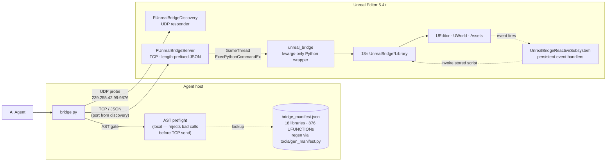

<p align="center">
  <h1 align="center">UnrealBridge</h1>
  <p align="center">
    <strong>Give your AI Agent the ability to control and edit Unreal Engine.</strong>
  </p>
  <p align="center">
    <a href="LICENSE"></a>
    <a href="https://www.unrealengine.com/"></a>
    <a href="https://www.python.org/"></a>
    
    
    <a href="https://claude.ai/code"></a>
    <a href="README.zh-CN.md"></a>
  </p>
</p>

<p align="center">
  
</p>

---

UnrealBridge is an Unreal Engine editor bridging layer built for AI Agents. It provides a typed operation surface for core scenarios such as animation-asset introspection, reactive event subscription, asset search and reference analysis, and automatic layout of Blueprint graphs. The Agent issues queries and modifications against a locally running editor instance; every change takes effect in real time, is bounded by the transaction system, and is undoable.

## Highlights

- **AST-based hallucination defense.** Before any script reaches UE, `bridge_preflight.py` parses it as Python AST and validates every `unreal.UnrealBridge*Library.fn(...)` call against an auto-generated manifest (18 libraries × 876 UFUNCTIONs) — catching unknown function/library names (with did-you-mean), wrong positional arg counts, unknown kwargs, and non-existent bridge-enum members **without ever round-tripping to the editor**. A second layer redirects raw `AssetRegistry` / `GameplayStatics` usage patterns to their bridge equivalents and tracks each returned value's type so attribute access on a `str` or `SoftObjectPath` doesn't silently misbehave; on a real `AttributeError` from a UE object the bridge calls back into UE Python, lists that live class's reflected `UPROPERTY`s, and emits a paste-ready correction (auto-handles `snake_case` ↔ `PascalCase` mismatches). A third layer ships a kwargs-only Python wrapper module so positional-arg-order errors are structurally impossible. Together these dropped a fresh-context agent's bridge-call failure rate from **24% → 16%** across A/B validation runs — protection that prompt-only "look-up-before-call" rules in `SKILL.md` had failed to deliver.

  <p align="center">
    
  </p>

- **Deep asset-structure introspection + author-level write ops.** `UnrealBridgeAnimLibrary` covers full queries over AnimBP state machines, AnimGraph nodes, linked layers, slots, curves, Sequence / Montage / BlendSpace, and the skeleton tree — paired with a full suite of write ops: building an ABP from scratch, adding / removing states / transitions / condition rules, creating and wiring AnimGraph nodes, auto-layout of both the state machine and AnimGraph. `UnrealBridgeAssetLibrary` goes beyond keyword search with forward-dependency and reverse-reference analysis, surfacing a complete dependency view to the Agent. Compared with basic CRUD wrappers or schemes that require hand-assembled reflection calls, this level of structured capability is available out of the box.
- **Reactive event subscription.** The Agent can subscribe to GAS events, attribute changes, actor lifecycle, AnimNotify, input, timers, and editor-side asset-change events. When the specified event fires, the bridge calls back proactively — no polling needed. This is a scenario that a pure request / response protocol cannot cover.
- **Agent control surface at PIE runtime.** `UnrealBridgeGameplayLibrary` provides aggregated world observation, navigation pathfinding, and input operations for movement / look / jump — suitable for AI-behavior validation, automated testing, and in-game NPC prototyping.
- **Blueprint graph quality toolchain.** More than just auto-layout: `auto_layout_graph`'s `pin_aligned` strategy reads live Slate geometry to align exec rails, `straighten_exec_chain` snaps the main rail, `collapse_nodes_to_function` extracts subgraphs, `lint_blueprint` scans by fixed rules for orphans / unnamed nodes / oversized functions / uncommented large graphs, and `add_comment_box` + preset palette (Section / Validation / Danger / Network / UI / Debug / Setup) partition graphs for readability. AnimGraph and state machines get dedicated `auto_layout_anim_graph` / `auto_layout_state_machine` (the latter recurses into each state's inner graph + every transition rule graph).
- **Native Python execution.** 18 `UnrealBridge*Library` surfaces expose ~880 `UFUNCTION`s in total, covering common subsystems; un-wrapped capabilities are reachable directly through the native `unreal.*` API. Compared to fixed-tool-list MCP schemes or reflection protocols that expose only a single `call` command, this design strikes a balance between flexibility and structure. Every level write op is wrapped in `FScopedTransaction` and supports standard Undo / Redo.

## Architecture



## Quick Start

### 1. Clone the repo

```bash
git clone https://github.com/<your-fork>/UnrealBridge.git
cd UnrealBridge
```

### 2. 🚨 Run `link_agents_skills.bat` (one-time)

**Required for Codex / Gemini CLI / OpenCode / Cursor.** Skip if you only use Claude Code.

The skill source of truth lives at `.claude/skills/`. This script creates an NTFS junction at `.agents/skills/` so every Agent runtime following the [Agent Skills open standard](https://www.agensi.io/learn/agent-skills-open-standard) sees the same content. Junctions can't be committed (Windows git limitation), so each clone has to materialize it locally — **once**.

```bat
link_agents_skills.bat
```

Mac / Linux equivalent: `ln -sfn .claude/skills .agents/skills` (run from repo root).

### 3. Install the plugin

Edit the `DST` line in `sync_plugin.bat` to point at your UE project's `Plugins/` folder:

```bat
set "DST=D:\Path\To\YourProject\Plugins\UnrealBridge"
```

Run `sync_plugin.bat`. It mirrors `Plugin/UnrealBridge/` into the project, skipping `Binaries/` and `Intermediate/`.

### 4. Build & launch

Open the `.uproject` and let UE rebuild the plugin automatically, or run the project's `Build.bat` from the command line. Launch the editor — the plugin starts the server at `PostEngineInit`. You're good once `LogUnrealBridge: Listening on 127.0.0.1:<port>` shows up in the log (the port is OS-assigned; the client finds it via multicast — no manual config needed).

### 5. Verify

```bash
python .claude/skills/unreal-bridge/scripts/bridge.py ping
# → pong
python .claude/skills/unreal-bridge/scripts/bridge.py exec \
  "import unreal; print(unreal.UnrealBridgeLevelLibrary.get_level_summary())"
```

### Claude Code integration (optional)

Copy the skill somewhere Claude Code can discover it:

```bash
cp -r .claude/skills/unreal-bridge ~/.claude/skills/            # user-wide
# or into the target project's own .claude/skills/
```

For `rebuild_relaunch.py` to auto-relaunch the editor, set one of:

```bash
setx UNREAL_EDITOR_EXE "C:\Program Files\Epic Games\UE_5.7\Engine\Binaries\Win64\UnrealEditor.exe"
setx UE_ROOT            "C:\Program Files\Epic Games\UE_5.7"
```

### Quick usage

Once the skill is installed, drop any of these into a Claude Code session:

- *"List every PointLight in the current level."*
- *"Move the PlayerStart up by 200 units."*
- *"Compile `/Game/Blueprints/BP_Character` and tell me whether it has errors."*
- *"Show me the state machines inside `/Game/Animations/ABP_Hero`."*
- *"Create an ABP on `SK_Mannequin` with an Idle / Walk / Run state machine driven by a `Speed` variable (>10 enters Walk, >200 enters Run), then layer a Slot + LayeredBoneBlend in the outer graph for an upper-body overlay."*

The Agent reads `SKILL.md`, picks the right `UnrealBridge*Library` function, calls it through `bridge.py`, and reports back.

## Usage

### CLI

```bash
bridge.py ping
bridge.py exec "print('hello from UE')"
bridge.py exec-file my_script.py
```

Flags (all optional — the common case works with no flags):

- `--project=<name|path>` — disambiguate when >1 editors are running
- `--endpoint=host:port` — skip discovery, connect directly (also env `UNREAL_BRIDGE_ENDPOINT`)
- `--token=<secret>` — only when the server binds non-loopback (also env `UNREAL_BRIDGE_TOKEN`)
- `--timeout` (default 30s), `--json`, `--discovery-timeout=<ms>` (default 800)

`bridge.py list-editors` sends a probe and lists every editor that answered — handy for multi-editor setups.

### From Python inside UE

```python
import unreal

summary = unreal.UnrealBridgeLevelLibrary.get_level_summary()
print(summary)

lights = unreal.UnrealBridgeLevelLibrary.find_actors_by_class(
    "/Script/Engine.PointLight", 50
)
print(len(lights), "point lights")
```

### Two reload loops

```bash
python .claude/skills/unreal-bridge/scripts/hot_reload.py        # body-only edits
python .claude/skills/unreal-bridge/scripts/rebuild_relaunch.py  # reflection changes
```

## Bridge libraries

| Library | Purpose |
|---|---|
| `UnrealBridgeServer` | TCP listener, length-prefixed JSON framing, GameThread dispatch |
| `UnrealBridgeBlueprintLibrary` | Full-stack Blueprint read / write: class hierarchy / variables / functions / components / interfaces / event dispatchers; graph call relationships, exec flow, pin connections, node search; 20+ node-type insertion (Branch, Cast, loops, Delay, Timer, SpawnActor, MakeStruct, …), pin connect, node-coordinate read / write, alignment, comment boxes, AutoLayoutGraph; compile-error query |
| `UnrealBridgeAssetLibrary` | Asset keyword search (include / exclude tokens); derived-class query; forward-dependency and reverse-reference analysis (recursive); DataAsset / StaticMesh / SkeletalMesh / Texture / Sound metadata; folder tree, redirector resolution, batch tag and disk-size query; **SearchableName index queries** (`find_assets_referencing_searchable_name` / `get_searchable_names_used_by_asset` / `list_searchable_name_values`) — the data backing the editor's right-click "Find References" on a `GameplayTag` / `PrimaryAssetId` / any USTRUCT-keyed named value |
| `UnrealBridgeAnimLibrary` | AnimBP deep introspection: state machines, AnimGraph nodes, linked layers, slots, curves; Sequence / Montage / BlendSpace asset info; skeleton tree, Sockets, VirtualBone, BlendProfile. **Write ops**: ABP creation and variables, state machine / state / conduit / transition add / remove / modify, transition properties (crossfade, priority, bidirectional), const-rule shortcut and real variable-driven rules (paired with the BP library to author `KismetMathLibrary` comparator nodes), 9 typed AnimGraph node factories + `add_anim_graph_node_by_class_name` fallback, pin connect / disconnect / reorder, auto-layout of AnimGraph and state-machine interiors; AnimNotify, sync marker, Montage Section, Socket CRUD |
| `UnrealBridgePoseSearchLibrary` | Motion Matching — `UPoseSearchSchema` / `UPoseSearchDatabase` introspection: schema channels and weights, database animation entries, sampling / branch sampling, indexing status (`wait-pose-index` CLI helper); pose evaluation against a runtime pose vector. The `DatabaseAnimationAssets` / `Channels` arrays are `private:` in C++ and unreachable via `get_editor_property` — this library is the only path |
| `UnrealBridgeChooserLibrary` | Motion Matching — `UChooserTable` introspection and authoring: columns, rows (with disabled flag and resolved result), context objects, NestedChooser drill-down (`:Name` paths). Write ops: column add / remove, row add / remove, set context object class with auto-Compile + PostEditChange so the editor refreshes. The `ResultsStructs` / `DisabledRows` arrays are `private:` in C++ — this library is the only path |
| `UnrealBridgeDataTableLibrary` | DataTable row-level read / write with conditional filters; CSV / JSON import / export; cross-table row copy, row-diff compare; reverse lookup by RowStruct to find every table referencing that struct |
| `UnrealBridgeCurveLibrary` | Curve assets (`UCurveFloat` / `UCurveVector` / `UCurveLinearColor`) and `UCurveTable` rows: asset info, key CRUD (batch-safe + atomic tangent writes), pre / post-infinity extrapolation, auto-tangent recompute, batch sampling (N time points in one round-trip), uniform sampling; curve-table row add / remove / rename / replace. Write ops broadcast `OnCurveChanged` so open Curve Editor tabs refresh instantly |
| `UnrealBridgeMaterialLibrary` | Material instance parameter queries |
| `UnrealBridgeUMGLibrary` | UMG widget tree, properties, animations, bindings, events; widget search by name / class; property writes |
| `UnrealBridgeLevelLibrary` | Actor query (name / Class / Tag / Folder / radius / Box / ray) and edit (spawn / destroy / transform / attach / visibility / Mobility, nested property read / write, function invocation); terrain height profile and Trace probing; in-editor custom NavGraph (nodes, edges, shortest path, JSON persistence); orthographic top-down view plus animation Pose / Montage timeline screenshots; every write op runs in a transaction |
| `UnrealBridgeEditorLibrary` | Editor session control: asset open / close / save / load; Content Browser and viewport; PIE start / stop / simulate / pause; undo / redo, console commands, CVars; batch Blueprint compile, redirector fixup; Live Coding trigger; screenshot, GBuffer channels (Depth / DeviceDepth / Normal / BaseColor) and HitProxy ID pass; tabs, notifications, diagnostics. Bridge self-observation: call log (ring-buffered request id, latency, endpoint, output size), latency stats, signature-registry JSON dump (one shot returns metadata for all ~880 `UFUNCTION`s) |
| `UnrealBridgeGameplayAbilityLibrary` | GameplayAbility / GameplayEffect / AttributeSet Blueprint metadata; tag hierarchy and matching; list abilities and effects by tag; actor ASC state (attribute values, active abilities / effects, cooldown checks); runtime `SendGameplayEvent` and attribute mutation; GA / GE / GC Blueprint authoring (CDO edit, GA graph nodes, GE magnitude / component / inherited tags, GC tag set) |
| `UnrealBridgeGameplayTagLibrary` | GameplayTag refactoring: `find_assets_referencing_tag` (with child-tag expansion), `list_all_registered_tags`, `get_tag_source_info`. Mutations `add_gameplay_tag` / `rename_gameplay_tag` (auto-redirect, redirect persistence hardened against UE 5.7's silent-drop quirk) / `remove_gameplay_tag`. Source enumeration via `list_tag_source_inis`; redirect ledger via `list_gameplay_tag_redirects` + `remove_gameplay_tag_redirect` for enumerate-then-sweep cleanup |
| `UnrealBridgePerfLibrary` | Structured perf snapshots: frame timing (FPS / GT / RT / GPU / RHI ms, stat-unit and raw modes), render counters (draw calls / primitives, summed across GPUs), process memory, `TObjectIterator` class histogram, ISO-8601 timestamped aggregate snapshot. USTRUCT output — no `stat unit` text parsing |
| `UnrealBridgeGameplayLibrary` | PIE-runtime Agent control: aggregated world observation, navigation pathfinding; movement / look / jump / teleport / sticky input, Enhanced Input and MappingContext; pawn velocity, ability, jump-arc simulation; camera ray, screen ↔ world, NavMesh projection; damage, physics impulse, time dilation, sound, camera shake; debug draw; AI-controller probing |
| `UnrealBridgeNavigationLibrary` | Export NavMesh as OBJ for external visualization and geometry analysis |
| `UnrealBridgeReactive*` | Event subscription framework with 10 adapters: runtime (GameplayEvent, AttributeChanged, ActorLifecycle, MovementMode, AnimNotify, InputAction, Timer) and editor (AssetEvent, PieState, BpCompiled); handler register / list / pause / resume / stats; cross-session JSON persistence. Replaces polling |
| `UnrealBridgePropertyLibrary` | **Privileged generic UPROPERTY surface.** Read / write any reflected property by dotted path with `[N]` array indexing — bypasses UE Python's binding-layer access checks (the "is protected and cannot be read" rejection, the EditDefaultsOnly-on-struct-copy rejection that blocks nested writes like `Modifiers[0].ModifierMagnitude.ScalableFloatMagnitude.Value`). `list_u_properties` returns full reflection (private/protected/bare UPROPERTY + decoded EPropertyFlags + metadata map); `array_append_u_property` auto-detects FGameplayTagContainer to maintain ParentTags cache; `get_asset_cdo_path` resolves the CDO path correctly. Wraps writes in `FScopedTransaction` + optional `PostEditChangeChainProperty` for editor-window refresh. |

## Protocol

Two channels:

1. **UDP multicast discovery** on `239.255.42.99:9876`. Client broadcasts a `probe` with a request id and an optional project filter; every running editor replies with its bound TCP address + port + token fingerprint. Multiple editors coexist on the same host via `SO_REUSEADDR`.

2. **TCP data** on the port the editor reports in its discovery response (OS-assigned; `127.0.0.1` by default). Length-prefixed JSON:

```
Request :  [4-byte big-endian length][{"id","script","timeout","token?"}]
Response:  [4-byte big-endian length][{"id","success","output","error"}]
Ping    :  {"id","command":"ping"}  →  pong
```

Token auth kicks in automatically when the server binds non-loopback; the client reads the token from `<Project>/Saved/UnrealBridge/token.txt` and includes it in every request.

Scripts run on the GameThread; captured stdout and stderr are separated by the special `__UB_ERR__` sentinel.

### Server config (CLI / env / `EditorPerProjectUserSettings.ini [UnrealBridge]`)

| CLI | Env | Default |
|---|---|---|
| `-UnrealBridgeBind=` | `UNREAL_BRIDGE_BIND` | `127.0.0.1` |
| `-UnrealBridgePort=` | `UNREAL_BRIDGE_PORT` | `0` (OS-assigned) |
| `-UnrealBridgeToken=` | `UNREAL_BRIDGE_TOKEN` | empty (required when bind ≠ loopback) |
| `-UnrealBridgeDiscoveryGroup=` | `UNREAL_BRIDGE_DISCOVERY_GROUP` | `239.255.42.99:9876` |
| `-UnrealBridgeNoDiscovery` *(flag)* | `UNREAL_BRIDGE_DISCOVERY=0` | discovery on |

## Repository layout

```
UnrealBridge/
├── Plugin/UnrealBridge/         # UE 5.4+ Editor plugin (C++)
│   ├── Source/UnrealBridge/     #   TCP server + bridge libraries
│   └── Content/Python/          #   Helpers auto-loaded into UE's Python env
├── .claude/skills/unreal-bridge/
│   ├── scripts/                 # bridge.py, hot_reload.py, rebuild_relaunch.py
│   └── references/              # Per-library API docs
├── docs/                        # Design notes and plans
├── tools/                       # Standalone helpers
└── sync_plugin.bat              # Mirror plugin into a UE project
```

## Requirements

- **Unreal Engine 5.4+** with `PythonScriptPlugin` and `GameplayAbilities` (both ship with the engine). The matrix at `tools/build_matrix.py` verifies builds against 5.4 and 5.7; some libraries (Chooser / PoseSearch / Material / Navigation + a few standalone UFUNCTIONs) require 5.7+ — see [docs/version-compatibility.md](docs/version-compatibility.md)
- **Windows 10/11** — the plugin itself is portable, but paths inside the helper scripts are hard-coded Windows-style
- **Python 3.9+** on PATH
- **Visual Studio 2022** with the UE workload — for plugin compilation
- **Claude Code CLI** — optional, only if you use the bundled skill

## Safety

- Every level-edit op is wrapped in `FScopedTransaction` — Ctrl+Z in the editor reverts anything the bridge did.
- The TCP server binds to `127.0.0.1` only; it is not reachable from the network.

## License

MIT — see [LICENSE](LICENSE).

---

<p align="center">
  
</p>
