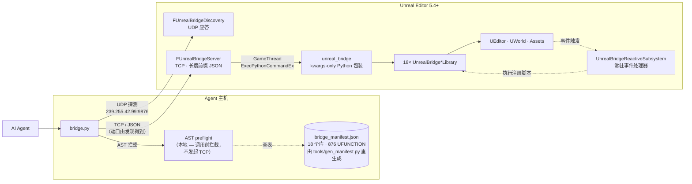

<p align="center">
  <h1 align="center">UnrealBridge</h1>
  <p align="center">
    <strong>让 AI Agent 具备控制、编辑 Unreal Engine 的能力。</strong>
  </p>
  <p align="center">
    <a href="LICENSE"></a>
    <a href="https://www.unrealengine.com/"></a>
    <a href="https://www.python.org/"></a>
    
    
    <a href="https://claude.ai/code"></a>
    <a href="README.md"></a>
  </p>
</p>

<p align="center">
  
</p>

---

UnrealBridge 是一个面向 AI Agent 的 Unreal Engine 编辑器桥接层，围绕动画资产内省、Reactive 事件订阅、资产搜索与引用分析、蓝图图谱自动布局等核心场景，提供一套类型化的操作接口。Agent 在本地正在运行的编辑器实例中发起查询与修改，所有变更实时生效，并受事务系统约束、可被撤销。

## 亮点

- **基于 AST 的防幻觉契约层。** 用户脚本到达 UE 之前，`bridge_preflight.py` 先用 Python AST 解析，对照自动生成的清单（18 个库 × 876 UFUNCTION）逐一校验每个 `unreal.UnrealBridge*Library.fn(...)` 调用——**不回到编辑器** 就能拦下不存在的库 / 函数名（带 did-you-mean）、错误的位置参数数量、未知关键字、不存在的桥接枚举成员。第二层把 `AssetRegistry` / `GameplayStatics` 的裸调用模式重定向到桥接等价物，并追踪每个返回值的实际类型，在对 `str` / `SoftObjectPath` 这类绑定类型做属性访问时给出警告；UE 对象抛出真正的 `AttributeError` 时则回查 UE Python，列出该类实际反射的 `UPROPERTY` 并给出可粘贴的修正代码（自动处理 `snake_case` ↔ `PascalCase` 的差异）。第三层 ship 一份纯关键字参数的 Python wrapper 模块，让"位置参数顺序写错"在语法层面就不可能发生。三层叠加把新会话 agent 的桥接调用失败率从 **24% 降到 16%**（A/B 验证）——这是先前仅靠 `SKILL.md` 的"调用前先查文档"提示规则一直没能稳定做到的。

  <p align="center">
    
  </p>

- **资产结构深度内省 + 作者级写操作。** `UnrealBridgeAnimLibrary` 覆盖 AnimBP 状态机、AnimGraph 节点、链接层、Slot、曲线、Sequence / Montage / BlendSpace 以及骨骼树的完整查询，并配套一整套写操作：从零搭建 ABP、增删状态 / 转移 / 条件规则、AnimGraph 节点创建与连线、状态机与 AnimGraph 的自动布局；`UnrealBridgeAssetLibrary` 在关键字搜索之外，支持资产的正向依赖与反向引用分析，可向 Agent 输出完整的依赖关系视图。相较于基础 CRUD 封装或需自行拼装反射调用的方案，该层次的结构化能力属于开箱即用。
- **基于 Reactive 系统的事件订阅。** Agent 可订阅 GAS 事件、属性变化、Actor 生命周期、AnimNotify、输入、定时器，以及编辑器端的资产变更事件。在指定事件触发时由桥接层主动回调，无需 Agent 轮询——这是纯请求 / 响应式协议无法覆盖的场景。
- **PIE 运行时的 Agent 控制接口。** `UnrealBridgeGameplayLibrary` 提供聚合式世界观测、导航寻路，以及移动 / 视角 / 跳跃等操作输入，适用于 AI 行为验证、自动化测试、游戏内 NPC 原型等运行时工作流。
- **蓝图工具链。** 不仅仅是自动布局：`auto_layout_graph` 的 `pin_aligned` 策略读取 Slate 实时几何对齐 exec 轨道、`straighten_exec_chain` 把主干拉直、`collapse_nodes_to_function` 提取子图、`lint_blueprint` 按固定规则扫 orphan / 未命名节点 / 过大函数 / 无注释大图，`add_comment_box` + 预设配色（Section / Validation / Danger / Network / UI / Debug / Setup）让图谱分区可读；AnimGraph 与状态机还有专用的 `auto_layout_anim_graph` / `auto_layout_state_machine`（后者递归进入每个状态内部 + 规则图）。
- **Python 原生执行。** 18 个 `UnrealBridge*Library` 累计约 880 个 `UFUNCTION`，覆盖常见子系统；未封装的能力可直接通过 `unreal.*` 原生 API 调用。相较于固定工具列表的 MCP 方案与仅暴露单一 `call` 命令的反射协议，该设计在灵活性与结构性之间取得了折衷。所有关卡写操作均包裹于 `FScopedTransaction` 内，支持标准 Undo / Redo。

## 架构



## 快速开始

### 1. 克隆仓库

```bash
git clone https://github.com/<your-fork>/UnrealBridge.git
cd UnrealBridge
```

### 2. 🚨 跑一次 `link_agents_skills.bat`(一次性)

**使用 Codex / Gemini CLI / OpenCode / Cursor 时必需。** 只用 Claude Code 可以跳过。

Skill 真源在 `.claude/skills/`,这个脚本会创建一个 NTFS junction `.agents/skills/`,让所有遵循 [Agent Skills 开放标准](https://www.agensi.io/learn/agent-skills-open-standard) 的 Agent 客户端都能看到同一份内容。Junction 在 Windows 下无法 commit 进 git,所以每次 clone 都需要在本地物化一次 —— **只需要一次**。

```bat
link_agents_skills.bat
```

Mac / Linux 等价命令:`ln -sfn .claude/skills .agents/skills`(在 repo 根目录跑)。

### 3. 安装插件

修改 `sync_plugin.bat` 里的 `DST`，指向你 UE 项目的 `Plugins/` 目录：

```bat
set "DST=D:\Path\To\YourProject\Plugins\UnrealBridge"
```

运行 `sync_plugin.bat`，它会把 `Plugin/UnrealBridge/` 镜像进项目，并跳过 `Binaries/` 与 `Intermediate/`。

### 4. 构建并启动

用 UE 打开 `.uproject` 让它自动重建插件，或从命令行跑项目自带的 `Build.bat`。启动编辑器 —— 插件会在 `PostEngineInit` 拉起服务器，看到日志里出现 `LogUnrealBridge: Listening on 127.0.0.1:<端口>` 就算成功。端口由 OS 分配，客户端通过多播发现自动找到它，不需要手动配置。

### 5. 验证

```bash
python .claude/skills/unreal-bridge/scripts/bridge.py ping
# → pong
python .claude/skills/unreal-bridge/scripts/bridge.py exec \
  "import unreal; print(unreal.UnrealBridgeLevelLibrary.get_level_summary())"
```

### Claude Code 集成（可选）

把 skill 拷到 Claude Code 能发现的位置：

```bash
cp -r .claude/skills/unreal-bridge ~/.claude/skills/            # 用户级
# 或拷进目标项目自己的 .claude/skills/
```

想让 `rebuild_relaunch.py` 自动重启编辑器，需设置其中之一：

```bash
setx UNREAL_EDITOR_EXE "C:\Program Files\Epic Games\UE_5.7\Engine\Binaries\Win64\UnrealEditor.exe"
setx UE_ROOT            "C:\Program Files\Epic Games\UE_5.7"
```

### 快速使用

skill 装好之后，把下面任意一句丢进 Claude Code 对话：

- *「列出当前关卡里所有的 PointLight。」*
- *「把 PlayerStart 向上移动 200 单位。」*
- *「编译 `/Game/Blueprints/BP_Character`，告诉我有没有报错。」*
- *「看看 `/Game/Animations/ABP_Hero` 里有哪些状态机。」*
- *「为 `SK_Mannequin` 创建一个 ABP，里面放一个 Idle / Walk / Run 状态机，转移规则用 `Speed` 变量（>10 进 Walk、>200 进 Run），外层再叠一个 Slot + LayeredBoneBlend 混入上半身覆盖动画。」*

Agent 会读 `SKILL.md`，挑出对应的 `UnrealBridge*Library` 函数，通过 `bridge.py` 发起调用，再把结果告诉你。

## 使用方式

### CLI

```bash
bridge.py ping
bridge.py exec "print('hello from UE')"
bridge.py exec-file my_script.py
```

参数（全部可选，常规使用可以一个都不传）：

- `--project=<名称|路径>` —— 同时跑多个编辑器时用来挑一个
- `--endpoint=host:port` —— 跳过发现直连（或环境变量 `UNREAL_BRIDGE_ENDPOINT`）
- `--token=<密钥>` —— 仅当 server 绑定非 loopback 时需要（或 `UNREAL_BRIDGE_TOKEN`）
- `--timeout`（默认 30 秒）、`--json`、`--discovery-timeout=<ms>`（默认 800）

`bridge.py list-editors` 发一次探测并列出所有响应的编辑器 —— 多编辑器场景的诊断快捷命令。

### 在 UE 的 Python 里调用

```python
import unreal

summary = unreal.UnrealBridgeLevelLibrary.get_level_summary()
print(summary)

lights = unreal.UnrealBridgeLevelLibrary.find_actors_by_class(
    "/Script/Engine.PointLight", 50
)
print(len(lights), "个点光源")
```

### 两种重载方式

```bash
python .claude/skills/unreal-bridge/scripts/hot_reload.py        # 只改函数体
python .claude/skills/unreal-bridge/scripts/rebuild_relaunch.py  # 动到反射
```

## 桥接库

| 库 | 作用 |
|---|---|
| `UnrealBridgeServer` | TCP 监听、长度前缀 JSON 帧、派发到 GameThread |
| `UnrealBridgeBlueprintLibrary` | 蓝图全栈读写：类层级 / 变量 / 函数 / 组件 / 接口 / 事件分发器；图谱的调用关系、执行流、引脚连接、节点搜索；20+ 类节点插入（Branch、Cast、循环、Delay、Timer、SpawnActor、MakeStruct 等）、引脚连接、节点坐标读写、对齐、注释框、AutoLayoutGraph；编译错误查询 |
| `UnrealBridgeAssetLibrary` | 资产关键字搜索（支持 include / exclude 词元）；派生类查询；正向依赖与反向引用分析（含递归）；DataAsset / StaticMesh / SkeletalMesh / Texture / Sound 元信息；目录树、重定向解析、批量 tag 与磁盘大小查询；**SearchableName 索引查询**（`find_assets_referencing_searchable_name` / `get_searchable_names_used_by_asset` / `list_searchable_name_values`）—— 编辑器右键 "Find References" 在 `GameplayTag` / `PrimaryAssetId` / 任意 USTRUCT 索引命名值上拿到的就是这套数据 |
| `UnrealBridgeAnimLibrary` | AnimBP 深度内省：状态机、AnimGraph 节点、链接层、Slot、曲线；Sequence / Montage / BlendSpace 资产信息；骨骼树、Socket、VirtualBone、BlendProfile。**写操作**：ABP 创建与变量、状态机 / 状态 / 导管 / 转移的增删改、转移属性（crossfade、优先级、双向）、常量规则捷径与真实变量驱动规则（配合 BP 库写 `KismetMathLibrary` 比较节点）、9 类 AnimGraph 节点工厂 + `add_anim_graph_node_by_class_name` 兜底、引脚连线 / 断开 / 移位、AnimGraph 与状态机的自动布局；AnimNotify、同步标记、Montage Section、Socket 的增删配置 |
| `UnrealBridgePoseSearchLibrary` | Motion Matching —— `UPoseSearchSchema` / `UPoseSearchDatabase` 内省：schema 通道与权重、数据库动画条目、采样 / 分支采样、索引状态（`wait-pose-index` CLI 辅助）；针对运行时 pose 向量做匹配评估。`DatabaseAnimationAssets` / `Channels` 在 C++ 里是 `private:`，`get_editor_property` 拿不到 —— 这个库是唯一通路 |
| `UnrealBridgeChooserLibrary` | Motion Matching —— `UChooserTable` 内省与作者：列、行（含 disabled 标记与解析后的结果）、上下文对象、NestedChooser 下钻（`:Name` 路径）。写操作：增删列 / 行、设置上下文类型时自动 Compile + PostEditChange 让编辑器刷新。`ResultsStructs` / `DisabledRows` 在 C++ 是 `private:` —— 这个库是唯一通路 |
| `UnrealBridgeDataTableLibrary` | DataTable 行级读写与条件过滤；CSV / JSON 导入导出；表间行复制、行差异比对；按 RowStruct 反查引用该结构的所有表 |
| `UnrealBridgeCurveLibrary` | 曲线资产（`UCurveFloat` / `UCurveVector` / `UCurveLinearColor`）与 `UCurveTable` 行的读写：asset info、键 CRUD（批量 + 原子切线写）、前 / 后无穷外推模式、Auto 切线重算、批量采样（N 个时间点一次往返）、等距采样；曲线表行的增删改查与重命名。写操作广播 `OnCurveChanged` 让打开的 Curve Editor 即时刷新 |
| `UnrealBridgeMaterialLibrary` | 材质实例参数查询 |
| `UnrealBridgeUMGLibrary` | UMG 控件树、属性、动画、绑定、事件查询；按名称 / 类搜索控件；属性写入 |
| `UnrealBridgeLevelLibrary` | Actor 查询（名称 / Class / Tag / Folder / 半径 / Box / 射线）与编辑（生成 / 销毁 / 变换 / 挂载 / 可见性 / Mobility、嵌套属性读写、函数调用）；地形高度剖面与 Trace 探测；编辑器内自定义 NavGraph（节点、边、最短路径、JSON 持久化）；正交俯视图与动画 Pose / Montage 时间轴截图；所有写操作走事务 |
| `UnrealBridgeEditorLibrary` | 编辑器会话控制：资产开关 / 保存 / 加载；Content Browser 与视口；PIE 启停 / 模拟 / 暂停；Undo / Redo、控制台命令、CVar；蓝图批量编译、重定向修复；Live Coding 触发；截图、GBuffer 通道（Depth / DeviceDepth / Normal / BaseColor）与 HitProxy ID pass；标签页、通知、诊断信息。Bridge 自观测：调用日志（请求 ID、耗时、端点、输出大小的环形缓冲）、性能统计、签名注册表 JSON dump（一次性输出全部 ~880 个 `UFUNCTION` 的元信息） |
| `UnrealBridgeGameplayAbilityLibrary` | GameplayAbility / GameplayEffect / AttributeSet 蓝图元信息；Tag 层级与匹配；按 Tag 列出能力与效果；Actor 的 ASC 状态（属性值、激活 Ability / Effect、Cooldown 检查）；运行时发送 GameplayEvent、修改属性；GA / GE / GC 蓝图作者支持（CDO 编辑、GA 图节点、GE magnitude / component / 继承 Tag、GC Tag 设置） |
| `UnrealBridgeGameplayTagLibrary` | GameplayTag 重构工作流：`find_assets_referencing_tag`（支持子 tag 展开）、`list_all_registered_tags`、`get_tag_source_info`。Mutation：`add_gameplay_tag` / `rename_gameplay_tag`（自动写 redirect，并针对 UE 5.7 的"redirect 静默丢失"问题做了持久化加固） / `remove_gameplay_tag`。源枚举 `list_tag_source_inis`；redirect 管理 `list_gameplay_tag_redirects` + `remove_gameplay_tag_redirect`，支持 enumerate-then-sweep 清理 |
| `UnrealBridgePerfLibrary` | 结构化性能快照：帧时序（FPS / GT / RT / GPU / RHI ms，支持 stat-unit 与 raw 两种模式）、渲染计数器（draw calls / primitives，跨 GPU 求和）、进程内存、`TObjectIterator` 类直方图、ISO-8601 时间戳聚合快照。USTRUCT 直出，无需解析 `stat unit` 文本 |
| `UnrealBridgeGameplayLibrary` | PIE 运行时 Agent 控制：聚合式世界观测、导航寻路；移动 / 视角 / 跳跃 / 传送 / 粘性输入、Enhanced Input 与 MappingContext；Pawn 速度、能力、跳跃轨迹模拟；相机射线、屏幕 ↔ 世界、NavMesh 投影；伤害、物理冲量、时间膨胀、音效、摄像机抖动；Debug 绘制；AI 控制器探测 |
| `UnrealBridgeNavigationLibrary` | NavMesh 导出为 OBJ，便于外部可视化与几何分析 |
| `UnrealBridgeReactive*` | 事件订阅框架，10 个 adapter：运行时（GameplayEvent、AttributeChanged、ActorLifecycle、MovementMode、AnimNotify、InputAction、Timer）与编辑器（AssetEvent、PieState、BpCompiled）；Handler 的注册 / 列表 / 暂停 / 恢复 / 统计；跨会话 JSON 持久化。替代轮询 |
| `UnrealBridgePropertyLibrary` | **特权级通用 UPROPERTY 接口。** 用 `Foo.Bar[N].Baz` 点路径读写任意反射字段 —— 绕开 UE Python 绑定层的访问检查（"is protected and cannot be read" 报错、struct 副本上 EditDefaultsOnly 子字段写入被拒,这正是 GE `Modifiers[0].ModifierMagnitude.ScalableFloatMagnitude.Value` 之类嵌套写入卡死的根因）。`list_u_properties` 返回完整反射(private/protected/裸 UPROPERTY + 解码后的 EPropertyFlags + metadata 全表)；`array_append_u_property` 自动识别 FGameplayTagContainer 维护 ParentTags 缓存；`get_asset_cdo_path` 正确解析 CDO 路径。写操作包 `FScopedTransaction` + 可选 `PostEditChangeChainProperty` 让编辑器实时刷新。 |

## 协议

两个通道：

1. **UDP 多播发现**：`239.255.42.99:9876`。客户端广播一个带 request_id 的 `probe`（可带 project 过滤器），每个运行中的编辑器单播回自己的 TCP 绑定地址 + 端口 + token 指纹。多编辑器通过 `SO_REUSEADDR` 共存。

2. **TCP 数据通道**：端口由编辑器在发现响应里给出（OS 分配，默认 `127.0.0.1`）。长度前缀 JSON：

```
请求:  [4 字节大端长度][{"id","script","timeout","token?"}]
响应:  [4 字节大端长度][{"id","success","output","error"}]
Ping:  {"id","command":"ping"}  →  pong
```

当 server 绑定非 loopback 时自动启用 token 鉴权；客户端从 `<Project>/Saved/UnrealBridge/token.txt` 读取并在每个请求里带上。

脚本在 GameThread 上执行；捕获的 stdout 与 stderr 通过特殊分隔符 `__UB_ERR__` 区分。

### 服务器配置（CLI / 环境变量 / `EditorPerProjectUserSettings.ini [UnrealBridge]`）

| CLI | 环境变量 | 默认 |
|---|---|---|
| `-UnrealBridgeBind=` | `UNREAL_BRIDGE_BIND` | `127.0.0.1` |
| `-UnrealBridgePort=` | `UNREAL_BRIDGE_PORT` | `0`（OS 分配） |
| `-UnrealBridgeToken=` | `UNREAL_BRIDGE_TOKEN` | 空（非 loopback 时必填） |
| `-UnrealBridgeDiscoveryGroup=` | `UNREAL_BRIDGE_DISCOVERY_GROUP` | `239.255.42.99:9876` |
| `-UnrealBridgeNoDiscovery` *(flag)* | `UNREAL_BRIDGE_DISCOVERY=0` | 默认开启 |

## 仓库结构

```
UnrealBridge/
├── Plugin/UnrealBridge/         # UE 5.4+ 编辑器插件(C++)
│   ├── Source/UnrealBridge/     #   TCP 服务器 + 桥接库
│   └── Content/Python/          #   UE Python 环境自动载入的辅助脚本
├── .claude/skills/unreal-bridge/
│   ├── scripts/                 # bridge.py、hot_reload.py、rebuild_relaunch.py
│   └── references/              # 各库 API 文档
├── docs/                        # 设计文档与规划
├── tools/                       # 独立小工具
└── sync_plugin.bat              # 把插件镜像进 UE 项目
```

## 系统要求

- **Unreal Engine 5.4+**，需启用 `PythonScriptPlugin` 与 `GameplayAbilities`（均为引擎自带）。`tools/build_matrix.py` 已对 5.4 与 5.7 验证通过；部分库（Chooser / PoseSearch / Material / Navigation 及少量独立 UFUNCTION）需要 5.7+，详见 [docs/version-compatibility.md](docs/version-compatibility.md)
- **Windows 10/11** —— 插件本身可移植，但辅助脚本里的路径按 Windows 风格写死
- **Python 3.9+**，已加入 PATH
- **Visual Studio 2022** + UE 工作负载 —— 用于编译插件
- **Claude Code CLI** —— 可选，只有使用自带 skill 时才需要

## 安全

- 所有关卡编辑操作都包在 `FScopedTransaction` 里 —— 编辑器内按 Ctrl+Z 可以撤销桥接做过的任何改动。
- TCP 服务器**默认绑到 `127.0.0.1`**，外网不可达。要开放 LAN 必须显式 `-UnrealBridgeBind=0.0.0.0 -UnrealBridgeToken=<密钥>`；非 loopback 绑定若未提供 token，server 会拒绝启动以避免 Python RCE 外漏。

## 许可证

MIT —— 见 [LICENSE](LICENSE)。

---

<p align="center">
  
</p>
